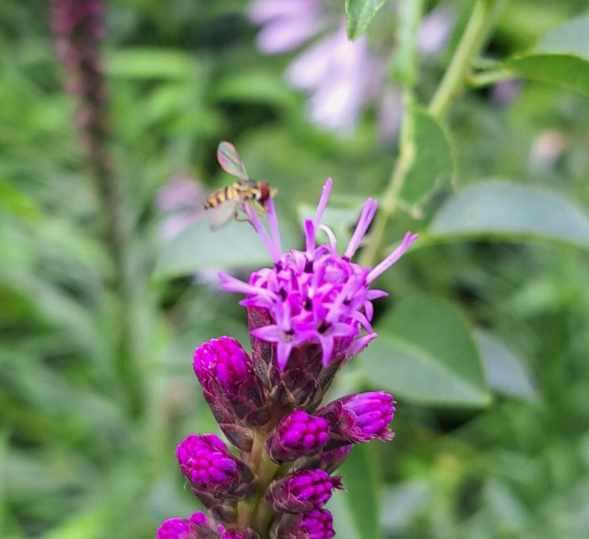

+++
updated = 2026-09-26T14:17:07
title = "Lawns"
date = 2025-09-13
+++

Lawns are, to be blunt, bad. Lawns are an outgrowth, in a very direct way of the American Chemical Weapons department of the army, and the attempts of that department and their corporate allies to continue to exist when there weren't people to kill with chemicals, anymore. So they turned their poisons to other things, and they used lawns to sell them.

tl;dr: lawns suck. 

Does this get an updated by? 